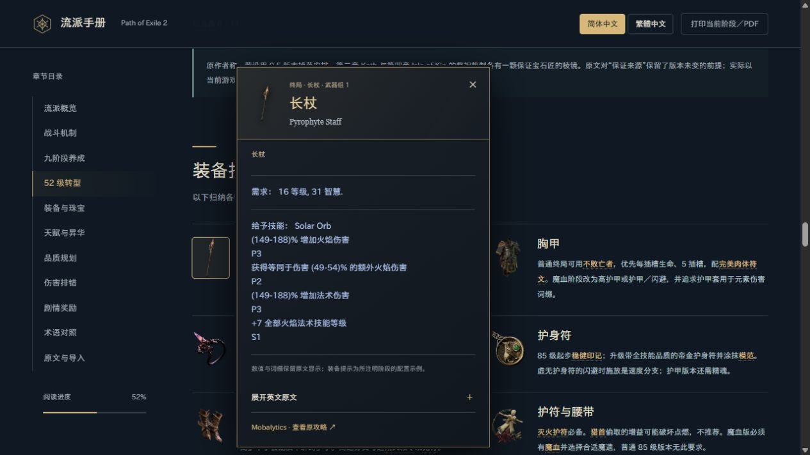
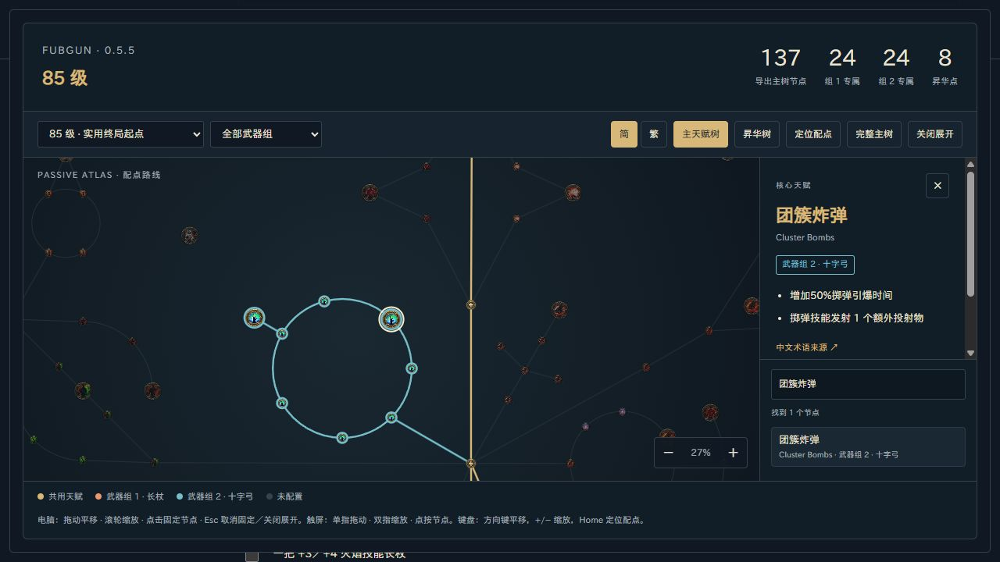

# 烈焰爆破 × 燃油掷弹

Fubgun《流亡黯道 2》古灵军团攻略的中文阅读版，按原文 **0.5.5** 版本整理。

**在线阅读：[GitHub Pages](https://fincerdw.github.io/poe2-flameblast-oil-grenade-guide/)**





## 功能

- 简体／繁体中文切换，术语参考 [流亡2编年史](https://poe2db.tw)。
- 九阶段养成与技能连线，同步展示阶段装备和两组武器。
- 交互天赋树：九阶段原作者配点、武器组切换、昇华视图、拖动缩放、中英文节点搜索与详情；支持展开和键盘操作。
- 247 份原文游戏提示：悬停查看、点击固定、Esc 关闭，支持手机点按。
- 可展开英文提示原文；相同外观珠宝保留独立词缀。
- 转型清单、剧情奖励勾选、品质计算和术语搜索；阅读设置保存在当前浏览器。
- 使用 [霞鹜新晰黑](https://github.com/lxgw/LxgwNeoXiHei)，字体、游戏图片和提示数据全部内嵌。
- 单个 HTML 可离线阅读，支持打印当前阶段／另存 PDF。

## 本地构建

需要 Python 3.12。构建使用已保存的资料，不需要联网采集。

```sh
python -m pip install -r requirements.txt
python build.py
```

生成 `烈焰爆破-燃油掷弹攻略.html`，可直接用浏览器打开。

构建与部署同名的首页：

```sh
python build.py --output _site/index.html
python -m http.server 8765 --directory _site
```

访问 <http://localhost:8765/>。在线页面保存为 HTML 后也可离线使用，原文／数据库等外部链接仍需网络。

## 项目结构

| 文件／目录 | 用途 |
| --- | --- |
| `build.py` | 整理九阶段内容，转换简繁，内嵌资料并生成单文件 |
| `template.html` | 页面结构、样式和阅读交互 |
| `prepare_tooltips.py` | 编译与翻译实际采集的原文提示 |
| `tooltip-ui.js`、`tooltip-ui.css` | 提示浮层、定位与图标尺寸约束 |
| `prepare_passives.py` | 校验九阶段配点、中文节点说明与原始图集，再内嵌天赋数据 |
| `passive-tree.js`、`passive-tree.css` | 交互天赋地图、阶段同步、搜索与节点详情 |
| `assets/passive/` | 开源规划器图集和 MIT 许可证 |
| `research/` | 构建所需的原文快照、术语、提示与素材清单 |
| `assets/game/` | 原攻略使用的游戏素材缓存 |
| `assets/font/` | 霞鹜新晰黑 WOFF2 和字体授权全文 |
| `fetch_assets.py` | 按已保存的素材清单重新下载图片，可选联网维护工具 |
| `.github/workflows/deploy.yml` | 推送 `main` 后自动构建并部署 GitHub Pages |

生成文件、临时分析输出、调试截图与 Python 缓存不提交到仓库；部署仅发布生成的 `index.html`。

## 来源与版本

原攻略：[0.5.5 Fubgun Flameblast Oil Grenade](https://mobalytics.gg/poe-2/builds/fubgun-flameblast-oil-grenade)，原作者 **Fubgun**，页面更新日期为 **2026-09-12**。中文整理日期为 **2026-10-02**。原文九阶段与英文提示均为采集时的快照，后续游戏改版不会自动同步。

本页保留正文与提示各自的版本数据；原文缺失数值不会补猜。九阶段天赋来自作者的 `.build` 导出，PoB 导入码仅对应原文的一个高预算配置。

天赋地图使用 [poe2-tools/poe2-build-planner](https://github.com/poe2-tools/poe2-build-planner) 的 **0.5.2** 数据和原始图集，固定来源提交 `a173f7b0d398951693fee83ee5ee40f327d4a749`。页面使用轻量 Canvas 渲染，原有许可证全文随离线 HTML 一起内嵌。全部九阶段的节点 ID 与图标均通过构建校验；已配置的 90 种节点名称、139 条不同效果均有简繁说明，英文原始效果可展开核对。

「导出主树节点」按原始导出中的共用节点与两组武器节点去重统计；部分阶段和原网页的 Main used 计数不同，不把它当作角色等级或所需点数。昇华起点、免费选择分支不计入昇华点。导出不含属性节点的属性选择。完整主树中与本流派无关的节点可能显示英文，后续版本不会自动同步。

这是非官方的中文整理项目。攻略、游戏美术及字体的来源、权利归属与授权见 [素材与授权说明](ASSET_NOTICES.md)。
